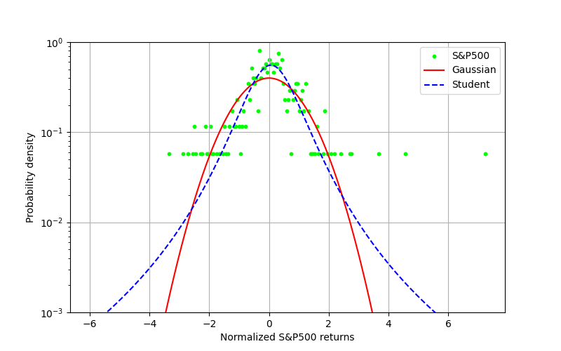
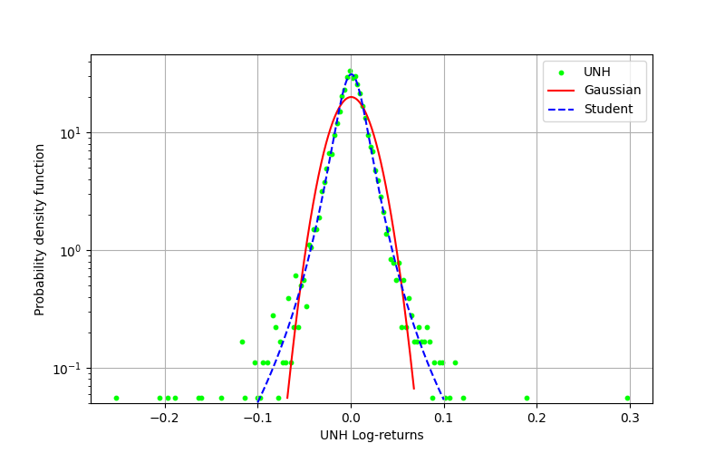
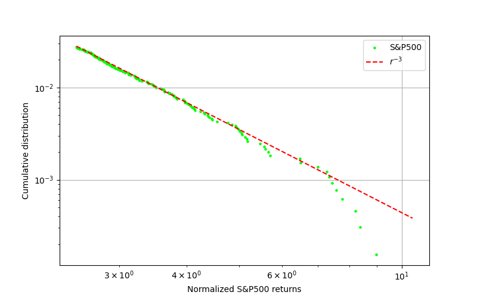
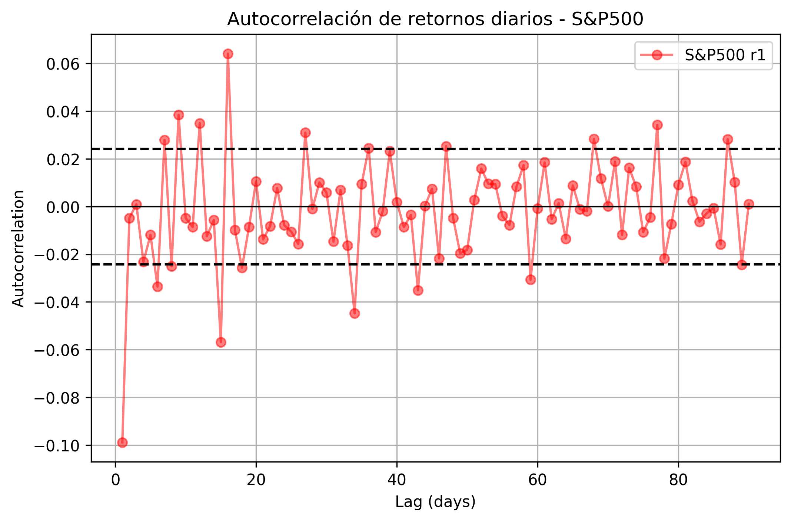
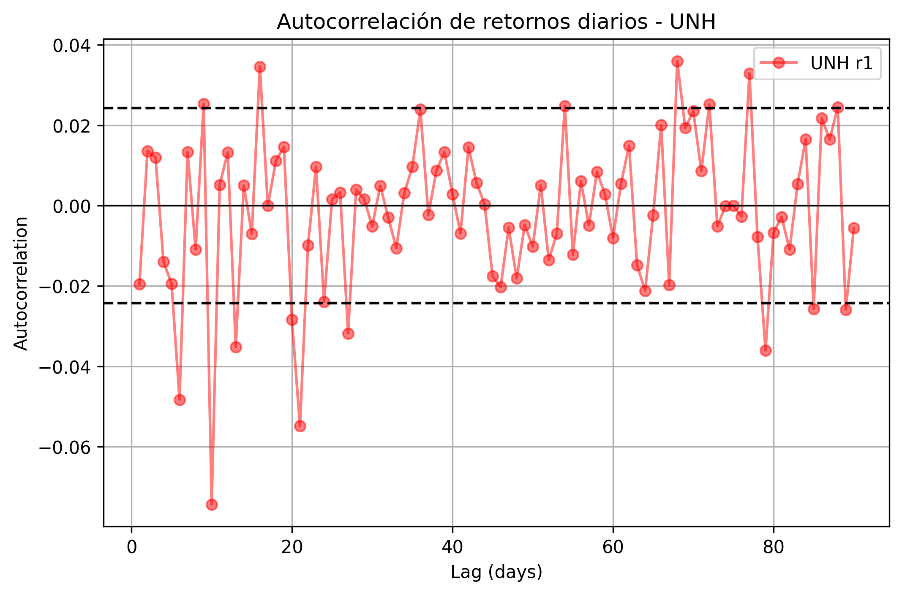
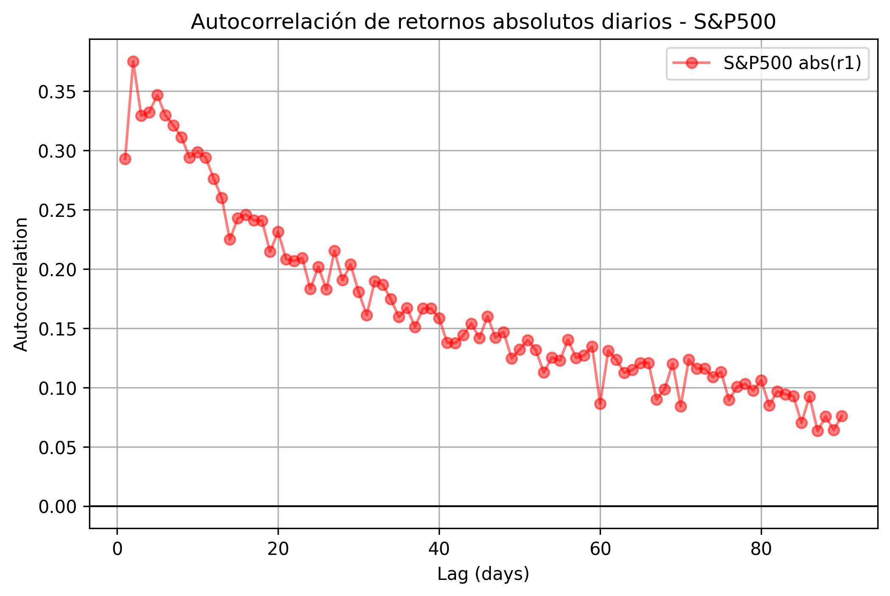
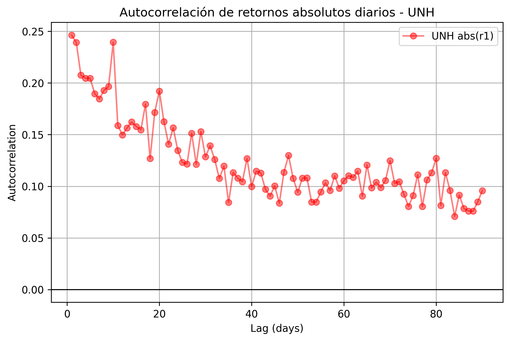
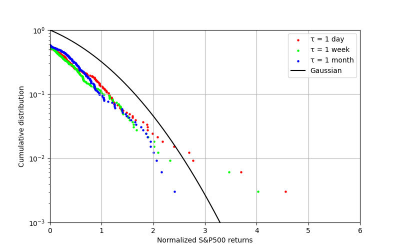
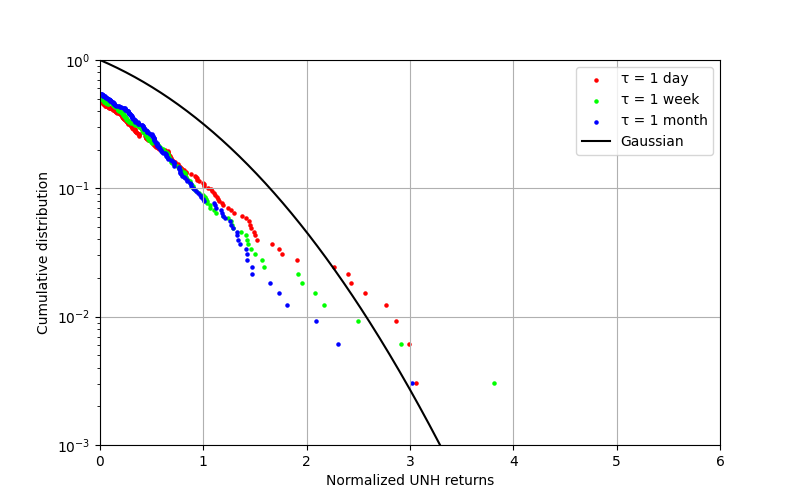

# Statistical Analysis of Financial Time Series: Stylized Facts

Empirical reproduction of key **stylized facts** in financial time series using real market data from the **S&P 500** index and **UnitedHealth Group (UNH)**.  
The analysis is performed on **CPI-adjusted prices** in order to study returns in real terms.

---

## Overview

Financial time series exhibit robust empirical regularities that are not well captured by simple Gaussian-based models. These regularities are commonly known as **stylized facts**.

This project reproduces and analyzes four of the most relevant stylized facts:

- Heavy-tailed return distributions  
- Absence of linear autocorrelation in returns  
- Volatility clustering  
- Aggregational normality  

The work is inspired by the econophysics literature, particularly Cont, R. (2001): Empirical properties of asset returns: stylized facts and statistical issues.

---

## Data

The analysis uses daily market data from:

- S&P 500 index (`^GSPC`)  
- UnitedHealth Group (`UNH`)  

Time period: 2000-01-01 to 2025-12-31

Prices are adjusted for inflation using the Consumer Price Index (CPI): P_real = P / CPI

Log-returns are computed as: r_tau(t) = log(P_t / P_{t-tau})

Time scales considered:

- τ = 1 (daily)  
- τ = 5 (weekly)  
- τ = 20 (monthly)  

Non-overlapping intervals are used for τ = 5 and τ = 20.

---

## Methodology

The workflow of the project is:

1. Download data using `yfinance`
2. Adjust prices using CPI
3. Compute log-returns
4. Normalize return series
5. Estimate empirical distributions
6. Compare with Gaussian and Student-t models
7. Compute autocorrelation functions
8. Analyze scaling behavior across time horizons

---

## Results

### 1. Heavy Tails

Empirical distributions exhibit **fat tails**, meaning extreme events occur more frequently than predicted by a Gaussian model.

Student’s t-distribution provides a better fit.

<p align="center">
  
  
</p>

The tail behavior is compatible with a power-law: P(|r| > x) ~ x^(-alpha)  //  alpha ≈ 3


<p align="center">
  
</p>

---

### 2. Absence of Autocorrelation

The autocorrelation of returns fluctuates around zero.

This indicates that returns behave approximately as **white noise**.

<p align="center">
  
  
</p>

---

### 3. Volatility Clustering

Absolute returns show significant autocorrelation with slow decay.

This reveals **volatility clustering**:

- Large changes → followed by large changes  
- Small changes → followed by small changes  

<p align="center">
  
  
</p>

---

### 4. Aggregational Normality

As the time scale increases, return distributions approach Gaussian behavior.

However, convergence is slow due to heavy tails and volatility clustering.

<p align="center">
  
  
</p>

---
## Repository Structure

```text
.
├── data/
│   ├── raw/
│   └── preparados/
│
├── figures/
│   ├── fat_tails/
│   ├── correlation/
│   └── cumulative_distributions/
│
├── src/
│   ├── preparar_datos.py
│   ├── variables.py
│   ├── fat_tails.py
│   ├── autocorrelation.py
│   └── cumulative_distributions.py
│
├── docs/
│   └── report.pdf
│
├── README.md
└── .gitignore
---

## How to Run

Install dependencies:

    pip install pandas numpy matplotlib scipy yfinance

Run the scripts:

    python src/preparar_datos.py
    python src/variables.py
    python src/fat_tails.py
    python src/autocorrelation.py
    python src/cumulative_distributions.py

---

## Report

Full report available at:

`docs/report.pdf`

---

## Key Takeaways

- Financial returns exhibit heavy tails and deviate from Gaussian models  
- Returns are uncorrelated, but volatility is not  
- Volatility clustering introduces temporal structure  
- Convergence to normality is slow  

---

## Reference

Cont, R. (2001). *Empirical properties of asset returns: stylized facts and statistical issues*

---

## Author

Carlos Porter Almaraz  
Physics graduate (UAM)  
MSc Statistics for Data Science (UC3M)


